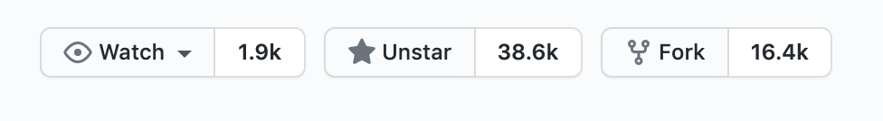
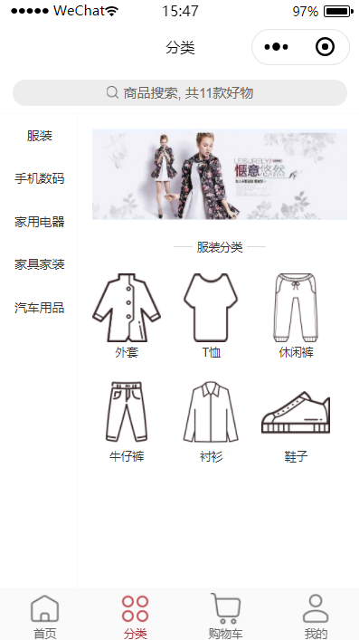
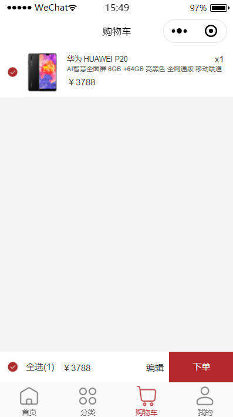
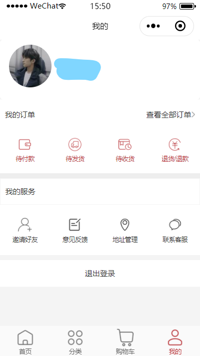
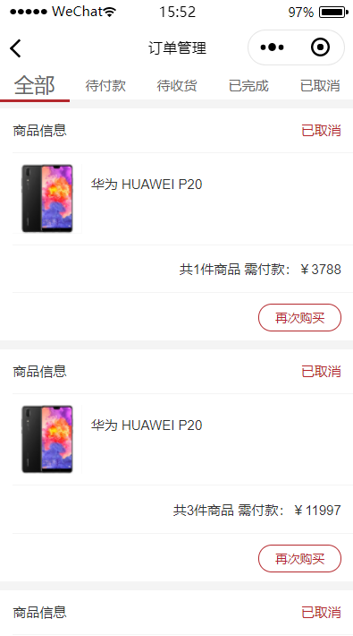

# mall-shop
***
## 前言

`mall-shop`项目建造了一个前后端分离的电商小程序项目

> 本项目前后端分别来源于不同的开源项目，我们的团队也对其进行了相应的修改、结合、完善。当前所实现的商城小程序基本实现了电子商城的基本功能，不足的地方我们也会在之后陆续进行进一步更新完善，也希望该项目能对大家有所帮助。
## 项目背景说明
`mall-shop`项目起源于我们团队想要尝试做一个前后端分离的电商小程序，在经过相关调研筛选，我们发现了在开源社区具有比较大技术影响力的[mall](https://github.com/macrozheng/mall)项目。

[mall](https://github.com/macrozheng/mall)项目是一套基于SpringBoot+MyBatis实现的电商系统

该开源项目中只包含有后台和前台管理前端项目，缺少一个C端项目，而在项目的ISSUE里对于该前端项目需求比较大。

故而，在本项目的开发实现中，我们的后端采用了[mall](https://github.com/macrozheng/mall)项目。
前端则采用开源项目[wechat_applet](https://github.com/Run2948/wechat_applet)中的前端小程序部分代码[wx-mall](https://github.com/Run2948/wechat_applet/tree/master/wx-mall)，在其基础上进行修改。
使其与后端整合在一起，实现了一个完整的电商系统。也解决了mall项目的前端需求。

在开发实现过程中，由于后端接口缺乏等种种原因，我们的小程序实现了一些商城应有的基本的功能，但是一些比较复杂的功能，例如团购、优惠券、立即购等功能暂未实现，而商城购物最后的支付一步，因微信支付需要向腾讯申请，未能实现。所以目前该项目仅仅作为一个拥有完整前后端的demo，供大家参考。项目中也还存在许多不足之处，也欢迎大家提出批评指正。 

`mall`项目地址：<https://github.com/macrozheng/mall>  
`wechat_applet`项目地址：<https://github.com/Run2948/wechat_applet>
## 项目介绍
mall-shop项目实现的是一个前后端分离的电商小程序，包括前台商城系统及后台管理系统，后端基于SpringBoot+MyBatis实现，采用Docker容器化部署。
前台商城小程序系统包含首页门户、商品推荐、商品分类、商品搜索、商品详情展示、购物车、加购&下单等订单流程、个人中心、订单管理、客户服务等模块。
### 项目相关地址
#### 后端
后端mall项目地址：https://github.com/TProgram/mall

后台管理系统mall-admin-web项目地址：https://github.com/macrozheng/mall-admin-web

## 项目组织架构（前端）
* config
* component  
* pages
* utils
* static/images
* services

## 项目部署（小程序部署）
- 开发工具：微信开发者工具
- 完成后端程序部署后，下载本项目小程序源码
- 填写APPID、项目名称等，进入小程序开发工具
- 进入之后修改config（配置）文件夹里的api.js文件，把MallApiRootUrl及SearchApiRootUrl替换为自己的后台接口地址即可运行。

## 小程序部分页面效果展示
### 首页：

### 商品分类：

### 购物车

### 个人中心

### 订单管理
